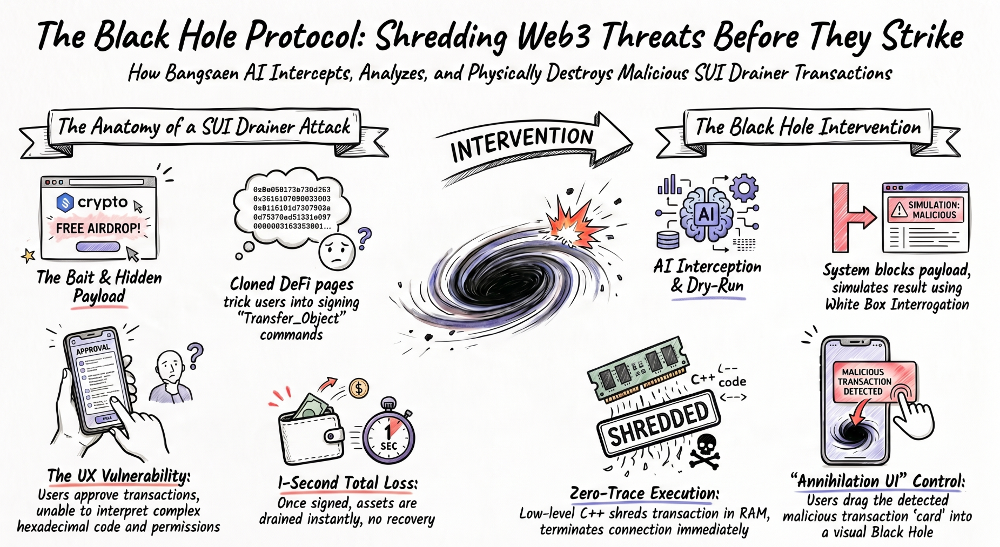

# 🕳️ Protocol 1042: The SUI Black Hole (Zero-Trace Agentic Gatekeeper)

**[ SUI OVERFLOW 2026: AGENTIC WEB TRACK ]**

Standard Web3 security relies on passive warnings. We built an active executioner. 
**The Black Hole Protocol** is an On-Premise, White Box AI Gatekeeper engineered to intercept, interrogate, and mathematically annihilate malicious SUI transactions before they ever reach the blockchain.

---

## 🚨 The Global Web3 Pain Point
Every day, users lose millions to "Drainer" smart contracts. The current infrastructure is fundamentally flawed:
1. **The UX Vulnerability:** Users are tricked by cloned DeFi pages (Airdrops, Mints) into signing malicious `Transfer_Object` payloads.
2. **Passive Wallets:** Wallets do not protect; they merely display complex hexadecimal codes and ask for approval. Users approve what they cannot read.
3. **1-Second Total Loss:** Once signed, assets are drained instantly. There is no undo button on the blockchain.

We are shifting the burden of security from the user's intuition to a **Deterministic AI Executioner**.

---

## 👁️‍🗨️ Visualizing The Black Hole Architecture

*(Architecture Flow: From Interception to Zero-Trace Execution)*

---

## ⚔️ The Black Hole Intervention (How It Works)

We don't use LLMs to "guess" if a transaction is safe. We use strict **White Box Logic** combined with **Low-Level C++ Execution**.

### 1. AI Interception & Dry-Run
When a user interacts with a dApp, the payload is intercepted locally before the wallet signature is triggered. The AI performs a strict Dry-Run simulation on the SUI network, analyzing state changes, balance drops, and `&mut` permission greed.

### 2. "Annihilation UI" Control
If malicious intent (Drainer) is detected, the standard wallet prompt is blocked. Instead, the user is presented with the **Black Hole UI**. They are empowered to visually drag the detected malicious transaction "card" directly into the void.

### 3. Zero-Trace Execution (The 1042 Purge)
This is not a simple "Reject" or "Delete". Dropping the payload into the Black Hole triggers a C++ Bare Metal purge:
* **Memory Shredding:** The transaction payload is overwritten with garbage data in the RAM.
* **Socket Termination:** Connection to the malicious RPC/dApp is instantly severed.
* **Result:** Zero traces remain. Hackers cannot scrape cache or memory to perform Replay Attacks.

---

## 🧬 Why White Box AI? (Beyond Standard Guardrails)
While the industry relies on probabilistic Generative AI (which can hallucinate), our Gatekeeper is **1042% Deterministic**. 
- It does not guess. It calculates. 
- If the math shows an unauthorized 100% asset drain -> $Ax = 0$ -> **Kill Command Executed**.

## 🤝 For SUI Developers (Hackathon Integration)
We are bringing the backend C++ Annihilation Core. We need SUI Move developers and Frontend engineers to build the bridge. 
Your dApp handles the Web3 logic; our Local Agentic Node handles the interception and execution. 

**Let's build the unhackable. See you at the SUI Overflow Hackathon.**

---

🚨 SUI OVERFLOW 2026 HACKATHON UPDATE 🚨
To all SUI Builders & Web3 Developers: Read this first.

What you see below is our baseline Cybersecurity PoC (Proof of Concept). It was built as a psychological and technical challenge against Korean APT Analysts to prove our White Box Agentic Logic. Yes, it is aggressive. Yes, it possesses OS-level destructive capabilities.

For the SUI Overflow Hackathon (Agentic Web Track), we are pivoting this exact architecture:

The Old Target (CyberSec Game): Interrogating the OS Environment. If a malware analyst uses a VM -> Annihilate the executable and lock the system.

The New Target (Web3 Reality): Interrogating the Blockchain Environment. If a SUI user interacts with a Scam/Drainer Smart Contract -> Annihilate the transaction signature and protect the wallet.

How we will work together:
You DO NOT need to download or run this weaponized binary on your machine. For the Hackathon, Bangsaen AI is lifting this core C++ interrogation engine to the Cloud.

We will provide a clean, scalable API Endpoint. You focus on writing SUI Move and building the dApp. We will provide the ultimate Agentic Security Gatekeeper to filter your transactions.

Let's build the unhackable. See you at the ON THE MOVE event this Saturday.

---

# 🌑 Protocol 1042: The True Zero-Trace Agentic Architecture

**[ PROJECT STATUS: CLASSIFIED PoC ]**

Standard encryption is for storing data. We built an architecture for weaponizing and annihilating it. 
**Protocol 1042** is not a communication tool. It is a paradigm shift in data sovereignty. 

Built on a hybrid architecture of **Flutter (Dart) UI** and **Low-Level C++ Destructive Logic**, it introduces the first "Agentic AI Gatekeeper" designed to interrogate its operator before execution.

---

## 🛡️ The Gatekeeper Protocol (Anti-Analysis)
This architecture is designed for **Bare Metal** execution only. 
We do not tolerate "Tourists", Reverse Engineers, or Sandbox Analysts.

- **Agentic Interrogation:** The system analyzes OS Locale, User Identity, and Intent.
- **Hardware-Level Guard:** Detects Hypervisors (VMware/VirtualBox), Debuggers, and Virtual Environments instantly.
- **The 1042 Purge:** Failure to pass the Gatekeeper's honesty test or running this architecture in a VM will trigger an immediate **System Lockdown**, mouse-trapping, and **Application Self-Destruction**.

## ☣️ Destructive Features
- **The .bam Standard:** Payloads are encrypted using dynamic XOR-Base64 patterns.
- **Forensic Annihilation:** Upon termination, the system executes a multi-pass shredding sequence, corrupting MFT records and wiping its own executable from the disk. **Zero traces remain.**

---

## 📦 Deployment & Execution

We do not hand out source code to the weak. Standard developers ask for repositories; real engineers face the Gatekeeper. 

The weaponized binary is available under the **[Releases]** tab.

1. Download the `Protocal-1042-Gatekeeper.zip` from Releases.
2. **Password:** `1024`
3. **CAUTION:** Strip your armor. Ensure all virtual environments are disabled. Run it on your Bare Metal host machine, or do not run it at all. 

## ⚖️ Legal Disclaimer
This software is provided for advanced cybersecurity research and educational purposes only. 
The developers assume no liability for misuse, locked systems, or accidental data destruction. 
**By executing this binary, you accept full responsibility for your host environment.**

*// End of Transmission //* 

--- 

## 🧬 The Genesis: White Box AI & Destructive Architecture

While the world is currently obsessed with Generative AI, the industry is ignoring a critical flaw: **They are building Black Boxes.** Standard Large Language Models (LLMs) hallucinate. Their decision-making processes are opaque, unpredictable, and ultimately, they cannot be fully trusted with absolute data sovereignty. 

The *Bangsaen Black Hole* and *Bangsaen Mail (Protocol 1042)* were not engineered merely to act as "Malware PoCs." They were built as foundational research to prove two radical paradigms in Artificial Intelligence:

### ⬜ 1. White Box AI (Deterministic Agentic Logic)
We reject the Black Box. The "Agentic Gatekeeper" inside Protocol 1042 is a strict **White Box AI**. 
- **Absolute Transparency:** Engineered in native C++, the creator knows exactly *how* and *why* the Agent makes every single decision.
- **Zero Hallucination:** It evaluates the host environment based on deterministic, OS-level truth (CPUID, Physical RAM allocation, Locale 1042 identity). 
- It does not guess or predict. It investigates, categorizes, and executes based on absolute systemic parameters.

### ☢️ 2. Destructive AI (The Authority to Annihilate)
Generative AI is built to assist and create. We built an AI with the autonomous authority to **destroy**. 
- **Actionable Authority:** Instead of just generating text in a terminal, our Agentic AI holds OS-level privileges. 
- **The Self-Destruct Protocol:** It can autonomously decide to cage mouse peripherals, trigger system sirens, and execute multi-pass forensic shredding. 
- **Zero-Trace Sovereignty:** If it detects a Sandbox, an active debugger, or an unauthorized Locale, it wipes its own MFT (Master File Table) records. True data sovereignty is not just about encryption; it is about the guaranteed annihilation of data when compromised.

**Protocol 1042** is the synthesis of these two paradigms. It is not just a secure communication tool—it is the first autonomous executioner designed to protect secrets through guaranteed self-destruction.
